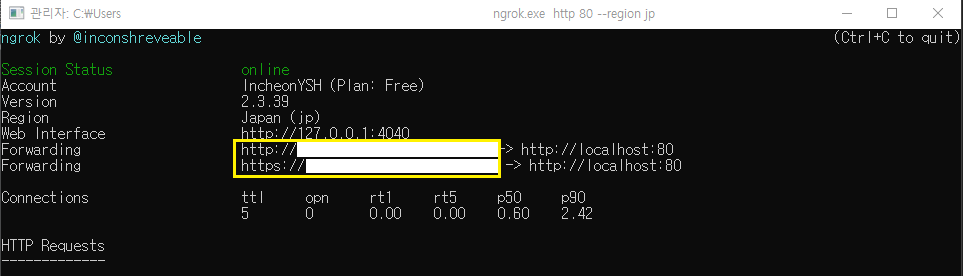
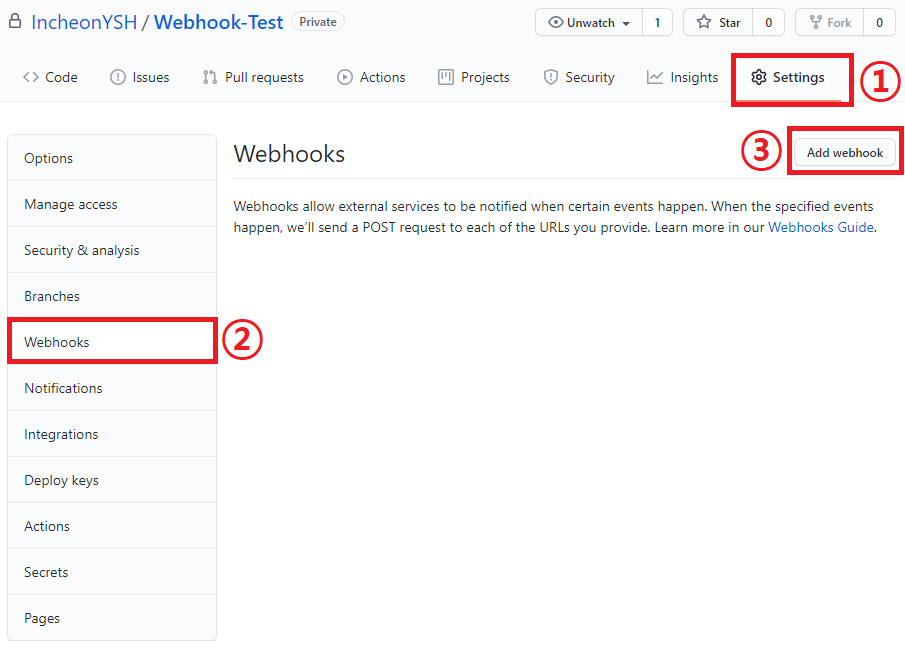
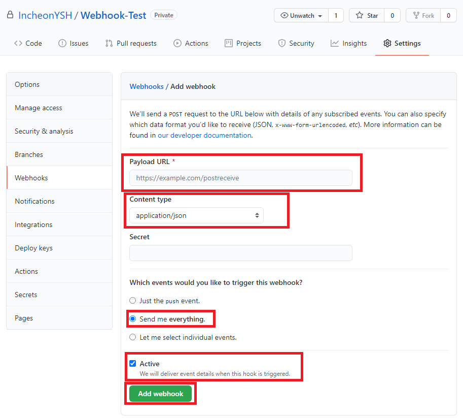
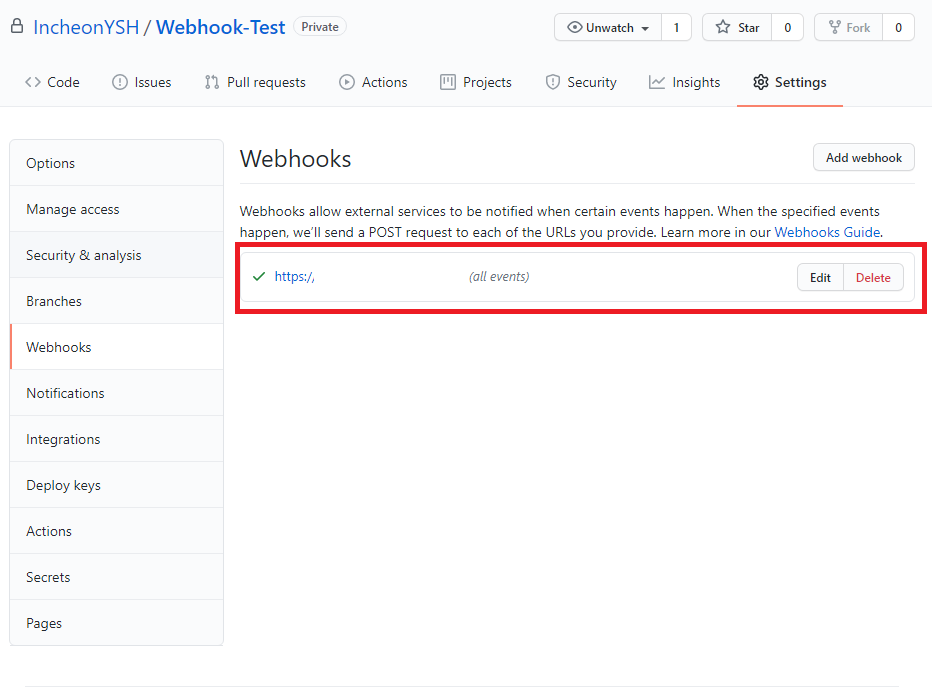
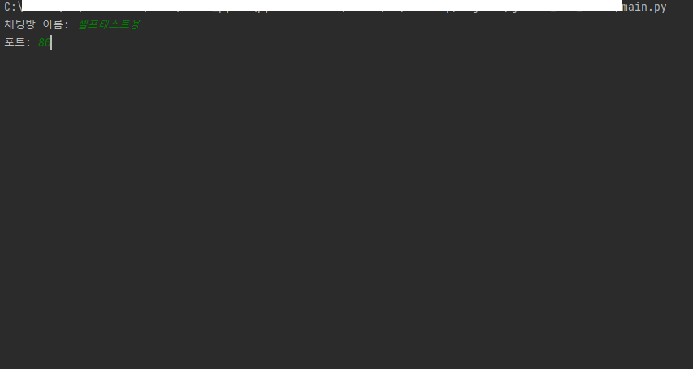

# Github notification for Kakao

Github 의 webhook 을 이용하여 지정한 repository 에 이벤트가 발생하면 원하는 카카오톡 채팅방으로 알림을 전송합니다.

* 지원하는 github 이벤트 리스트
  * push
  * issues
  * issue_comment
  * commit_comment
  * create
  * delete
  * pull_request
  * pull_request_review
  * pull_request_review_comment
  * fork

<br>

<br>

<br>

### 필요 패키지

```powershell
pip install Flask
pip install pywin32
```

<br>

### 사용법

**1. ngrok 설정**

   * https://dashboard.ngrok.com/get-started/setup 으로 접속하여 ngrok 을 설치한 뒤 사이트의 지시대로 토큰을 설정합니다.

   * ngrok.exe 를 실행한 뒤 아래 명령어를 입력합니다.

     ```powershell
     ngrok.exe http 80 --region jp
     ```

   * ###### 아래와 같은 창이 표시되어야 합니다.

     

<br>

<br>

**2. Github 설정**

   * 알림을 받기를 원하는 repository 의 `Settings` 에서 `Webhooks` 탭을 선택한 뒤 `Add webhook` 버튼을 클릭합니다.

     

     <br>
   
   * Payload URL 에는 forwarding 된 url 을 입력합니다([ngrok 윈도우의 노란색 박스](#아래와-같은-창이-표시되어야-합니다))
   
   * Content type 은 `application/json` 으로 선택합니다
   
   * `Send me everything` 선택
   
   * `Active` 선택
   
   * 마지막으로 `Add webhook` 클릭
   
     

   <br>

   * 다음과 같이 웹훅이 추가된 것을 확인할 수 있습니다.
   
     

<br>

3. `main.py` 실행

   * `main.py` 파일을 실행합니다.

   * `채팅방 이름:` 알림을 받기를 원하는 카카오톡 채팅방 이름을 입력합니다.

   * `포트: ` 포트를 입력합니다.

     *예시*

     

   * 완료되었습니다. 이제 카카오톡으로 repository 의 이벤트 알림을 받을 수 있습니다.